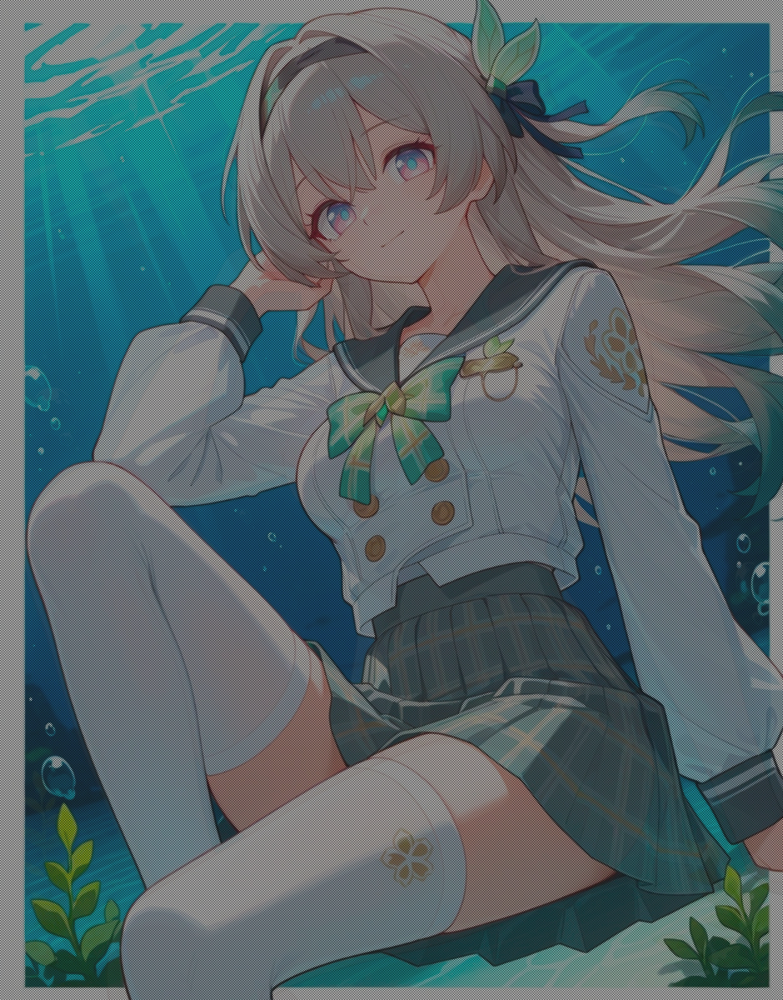

# 一种新型的涩图隐藏方式？

最近，我朋友从他的QQ群里给我分享了一张涩图



？你管这叫涩图？

但在他告诉我正确的食用方法：+亮度、+曝光度之后……

<video src="readme-img/woc.mp4"></video>

卧槽？！

为了研究这张图片，我用了一个下午的时间，最终就~~水~~有了这个仓库

果然涩涩才是第一生产力啊\[狗头\]

> 注：经过我的研究，如果手机上没有曝光度的调节方式，多次少量同时增加亮度和曝光度可达到类似效果

鉴于我在网上没有找到这种方式的名称，就姑且认为这是一种新型的藏图方式啦~

## 仓库说明

* `test-seperate.py` 是我一开始研究写的脚本
* `merge.py` 是用来将图片合并的代码
* `seperate.py` 是用来将合并的图片分开的代码
* `tank.py` 是因为刚好想到所以顺手写的“幻影坦克”的代码
* `util.py` 是用来统一图片大小的辅助模块

——————分——————割——————线——————

* `test-1.png`、`test-2.png` 是分离的结果
* `test.png` 是`merge.py`运行的结果，里面有三张图哦，试着看看吧（SFW，放心食用）
* `testMT.png`、`testMT2.png` 是两张幻影坦克
* `test-img/sep` 存放了那张涩图的合并（mix.png）、分离（0.png、1.png）、复原（0.ori.png）结果
* `test-img/mer` 存放了我早年用爬虫下的二刺螈图片的一部分，仅供学习研究使用

## 关于内容……

这个仓库中的图片均来源网络，仅供学习研究等个人非盈利使用，如有侵权，请联系删除。

仓库中的大部分代码还是我手工编写的，有注释的部分是AI编写的。

## 原理

将图片合并是通过将两张（当然也可以更多张）
大小相同的图片的像素交替排列实现的。

将N张图片合并会导致最终合成的图片长宽各翻N倍。

细心的你可能已经注意到了，好像多了像素？

没错，所以大图的像素应该是这样拼合的（以N=3为例）：

```

1 2 3   X X X   O O O
4 5 6 + X X X + O O O
7 8 9   X X X   O O O

  1 X O | 2 X O | 3 X O
  O 1 X | O 2 X | O 3 X
  X O 1 | X O 2 | X O 3
  - - - + - - - + - - -
  4 X O | 5 X O | 6 X O
= O 4 X | O 5 X | O 6 X
  X O 4 | X O 5 | X O 6
  - - - + - - - + - - -
  7 X O | 8 X O | 9 X O
  O 7 X | O 8 X | O 9 X
  X O 7 | X O 8 | X O 9

```

每个像素会被重复N变，这样就够像素了。

至于曝光度显影嘛……如果观察分离出来的图就知道了：

所谓的黑色像素并非#000000，而是有图案的。

通过预先将涩图的亮度和曝光度降低而达到隐藏的效果，
事后就可以通过相反的操作还原了（当然，是有损的）
